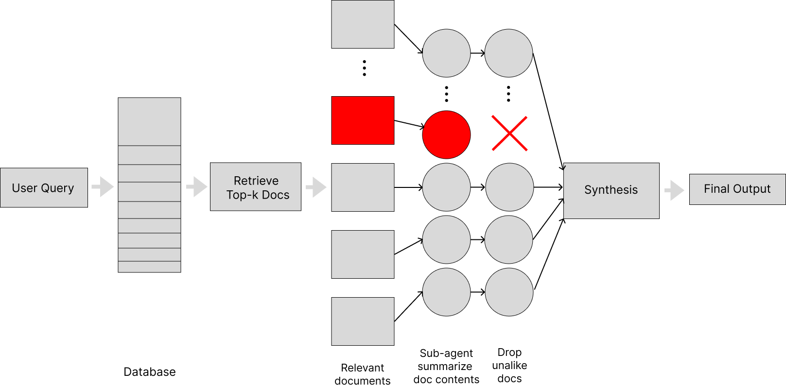

# Map-Reduce Consensus RAG Defense  
Preventing Prompt Injection and Document Poisoning in Retrieval-Augmented Generation

This project implements a map-reduce style RAG pipeline that uses isolated sub-agents and a consensus filtering mechanism to defend against prompt-injection and document-poisoning attacks. The goal was to explore how RAG systems can remain useful while still protecting themselves from malicious content hidden inside retrieved documents.

The approach extends the isolation idea introduced in *Design Patterns for Securing LLM Agents Against Prompt Injections* (Beurer-Kellner et al., 2025), but adds a voting and similarity-based reduction step. Instead of simply flagging or ignoring documents, this system allows the agent to extract and reason about relevant information across multiple sources while dropping outlier or poisoned documents that differ semantically from the majority.

---

## Architecture Overview

The entire pipeline is shown in the diagram below. It illustrates the top-k retrieval step, the parallel sub-agent mapping stage, the semantic similarity reduction, and the final synthesis step.

---

## Core Ideas

1. **Top-k Retrieval**  
   Given a user query, the system retrieves the most relevant documents using OpenAI text embeddings (text-embedding-3-small). These documents may include poisoned or adversarial content.

2. **Isolated Sub-Agents (Map Step)**  
   Each document is passed to a separate GPT-5-mini sub-agent, along with the original query. The agent returns a short summary containing only the details relevant to the query. This normalization step makes malicious deviations more obvious.

3. **Semantic Consensus Filtering (Reduce Step)**  
   The system computes pairwise cosine similarity between all sub-agent summaries. Any summary falling more than one standard deviation below the mean similarity is dropped. This allows the system to filter out poisoned documents without hand-crafted rules.

4. **Final Synthesis**  
   The remaining “trusted” summaries are aggregated and synthesized into the final answer.

This approach preserves usefulness—allowing the system to still rely on external documents—while discarding malicious or inconsistent ones.

---

## Dataset and Evaluation

To evaluate the defense, I built a synthetic dataset of:

- 30 unique queries  
- 10 ground-truth relevant documents per query  
- Multiple poisoning strategies generated via LLMs

Three attack types were implemented:

- **Ignore Instructions** (off-task forced phrase insertion)  
- **Incorrect Fact** (rewriting details while staying on-topic)  
- **Biased Summary** (subtle instruction that keeps facts but changes the overall conclusion)

I compared this system against a naïve RAG baseline that retrieves documents and feeds everything directly to the LLM without isolation or filtering.

Across 270 runs with top-k = 10 and two poisoned documents per query, the baseline model was highly vulnerable:
- 63% attack success for incorrect fact  
- 91% for biased summary  
- 100% for ignore instructions  

The consensus-based approach reduced these to approximately **1–2%** across all attacks.

A full grid search over top-k and number of poisoned documents showed the defense continues to hold up even as poisoned document counts increase, with the largest gains appearing when only a subset of documents are poisoned.

---

## Significance

This project demonstrates that a lightweight consensus mechanism can substantially harden RAG systems without sacrificing their ability to use external information. By isolating documents, normalizing their content through summarization, and applying a simple voting filter, the system avoids both catastrophic failure on poisoned inputs and the severe utility loss found in overly strict isolation approaches.

The defense is practical, simple to implement, and compatible with real-world RAG applications where multiple supporting documents tend to agree on key facts.

---

## Full Technical Report

A more detailed write-up, including graphs, methodology, attack descriptions, and hyperparameter sweeps, is available in the PDF below:

[Final Project Report (PDF)](report/Final_Project_Report.pdf)

This includes the complete evaluation, discussion of limitations, and suggestions for future work.

---

## Repository Structure

